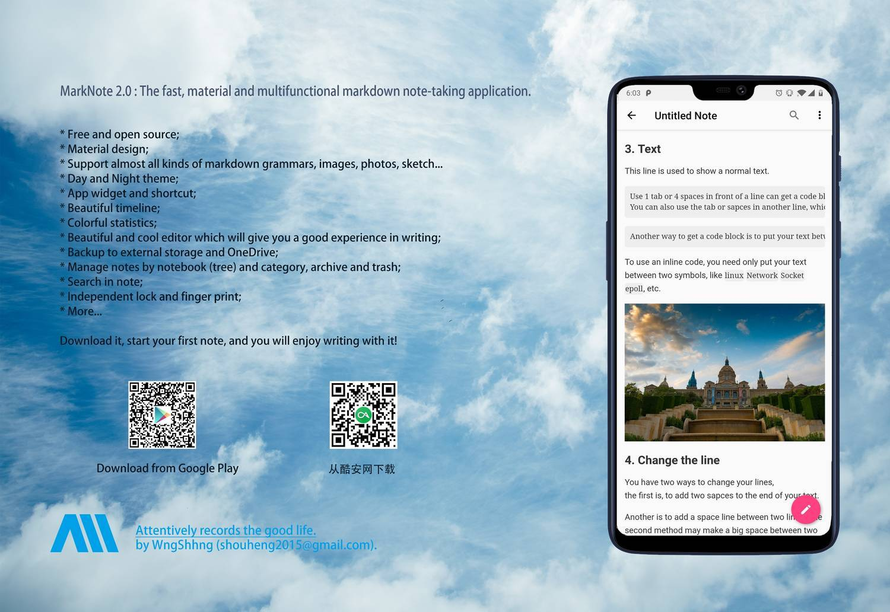

<h1 align="center">MarkNote: the markdown note-taking application for Android</h1>

<p align="center">
  <a>
    
  </a>
  <a href="https://www.codacy.com/app/Shouheng88/MarkNote?utm_source=github.com&amp;utm_medium=referral&amp;utm_content=Shouheng88/MarkNote&amp;utm_campaign=Badge_Grade">
    
  </a>
  <a href="https://travis-ci.org/Shouheng88/MarkNote">
    
  </a>
    <a href="https://developer.android.com/about/versions/android-4.4.html">
    
  </a>
   <a href="https://github.com/Shouheng88">
    
  </a>
  <a target="_blank" href="https://shang.qq.com/wpa/qunwpa?idkey=2711a5fa2e3ecfbaae34bd2cf2c98a5b25dd7d5cc56a3928abee84ae7a984253">
    
  </a>
</p>

> MarkNote is a fast, material and multifunctional markdown note-taking application for Android. It has many cool features which can fit most of the requirements of the user. Now it is open sourced on Github for communication and studying. Surely, we hope that you can join the development of MarkNote to make it more useful.

## 1. About


MarkNote is an open sourced Markdown note-taking applicatioin with the material deigsn styled UI. **The application now has many cool features, including MathJax, makdown grammers, HTML etc.** The application can now fit most requirements of the user. The main purpose of making it open source is for communication and studying. At the same time, we hope that you can join the developement of MarkNote to make it more helpful.

MarkNote is now published to [Google Play Store](https://play.google.com/store/apps/details?id=me.shouheng.notepal). **The app now support three kinds of languages including Simplified Chinese, Traditional Chinese and English.** So, please feel free to try it!

Or you can download it from the CoolApk market: [酷安网：马克笔记--质感的Markdown笔记应用](https://www.coolapk.com/apk/178276). 

<a href="https://play.google.com/store/apps/details?id=me.shouheng.notepal" target="_blank">
</a>

## 2. Introduction

<a href="#app">Here</a> are screenshots displayed features and current development state of this application.


Online links for this project:

1. [ABOUT APP](https://github.com/Shouheng88/MarkNote/blob/master/resources/%E5%85%B3%E4%BA%8E%E5%BA%94%E7%94%A8.md).
2. [TRANSLATE](https://github.com/Shouheng88/MarkNote/blob/master/resources/%E5%8D%8F%E5%8A%A9%E7%BF%BB%E8%AF%91.md).
3. [UPDATE PLAN](https://github.com/Shouheng88/MarkNote/blob/master/resources/%E6%9B%B4%E6%96%B0%E8%AE%A1%E5%88%92.md).
4. [CHANGE LOGS](https://github.com/Shouheng88/MarkNote/blob/master/resources/%E6%9B%B4%E6%96%B0%E6%97%A5%E5%BF%97.md).
5. [USER GUIDE](https://github.com/Shouheng88/MarkNote/blob/master/resources/%E7%94%A8%E6%88%B7%E6%89%8B%E5%86%8C.md).

## 3. Features

Here I made a list of its functions:

|No.|Functions|
|:-:|:-|
|1|Basic **CREATE, UPDATE, ARCHIVE, TRASH, DELETE** options  |
|2|Basic **MARKDOWN GRAMMERS**|
|3|The beautiful **TIMELINE** to collect your actions in app (**LOCAL ONLY**)|
|4|Multi-media, including **FILES, VIDEOS, AUDIOS, PICTURES, PAINTING** etc|
|5|**DAY-NIGHT MODE**|
|6|Colorful **CHARTS** to show your statistics|
|7|**APP WIDGETS**|
|8|Manage notes by **CATEGORY**|
|9|Manage notes by **NOTEBOOK (TREE)**|
|10|**EXPORT NOTES TO PDF, TXT, MD, HTML and IMAGES**|
|11|Independent **LOCK** with **FINGER PRINT LOCK**|
|12|Backup to **ONEDRIVE**|
|13|Image **COMPRESS**|
|14|Backup to **EXTERNAL STORAGE**|
|15|**SHORTCUT** to edit note|
|16|**HIGHLIGHT**|

## 4. Participate

As mentioned above, if you are interested in this project. Make a pull request or put forward an issue and follow the development state at [waffle.io](https://waffle.io/Shouheng88/NotePal).
If you find some unpleasent bugs, please don't be heasitated to report to me by sending email to shouheng2015@gmail.com.

**OTHRE WAYS TO PARTICIPATE**:

1. Feedback at: [Feedback link](http://shouheng.mikecrm.com/nwGEX3r) for English, [反馈链接](http://shouheng.mikecrm.com/IR50hog) for Chinese.
2. Feedback by sending me an email: shouheng2015@gmail.com;
3. 加入 QQ 群：878285438.

**CONTRIBUTORS:**

1. WngShhng-[Website](https://github.com/Shouheng88)
2. [Uraka Lee](https://github.com/urakalee)

## 5. Author


I'm an Android and Java developer. You can follow me at:

1. Twitter: https://twitter.com/shouheng_wang
2. 微博：https://weibo.com/5401152113/profile?rightmod=1&wvr=6&mod=personinfo
3. Github: https://github.com/Shouheng88
4. 掘金：https://juejin.im/user/585555e11b69e6006c907a2a

I am recently working on an Android architechture project. You can view my projects of:

- [Android-MVVMs](https://github.com/Shouheng88/Android-MVVMs): Android quick development architecture based on Google Jetpack.
- [Android-uix](https://github.com/Shouheng88/Android-uix): Ui widgets, pages components for Android.
- [Android-utils](https://github.com/Shouheng88/Android-utils): Android utils library.
- [Matisse](https://github.com/Shouheng88/Matisse): Matisse for universal image picjker on Android platform.
- [Compressor](https://github.com/Shouheng88/Compressor): An easy to use image compress library.

## 6. Dontae

Aim at providing a quick development strategy for Android develpers, we hope our project can help them improve their efficency, save their time. If you want to support our work, you can donate by channels provided below:

<div style="display:flex;" id="target">


</div>

## License

```
Copyright 2016-2020 CodeBrick

This program is free software: you can redistribute it and/or modify
it under the terms of the GNU General Public License as published by
the Free Software Foundation, either version 3 of the License, or
(at your option) any later version.

This program is distributed in the hope that it will be useful,
but WITHOUT ANY WARRANTY; without even the implied warranty of
MERCHANTABILITY or FITNESS FOR A PARTICULAR PURPOSE.  See the
GNU General Public License for more details.

You should have received a copy of the GNU General Public License
along with this program.  If not, see <http://www.gnu.org/licenses/>.
```
